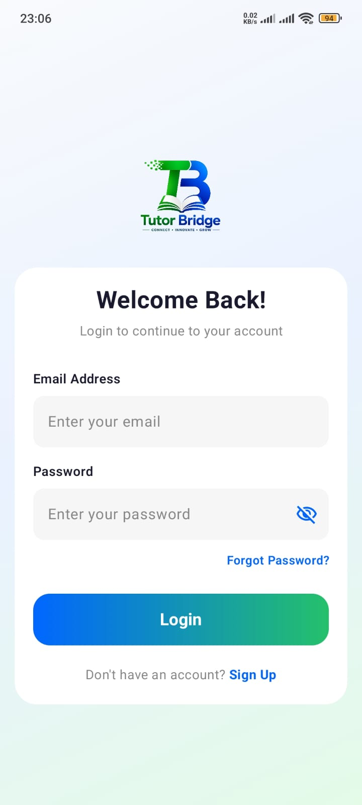
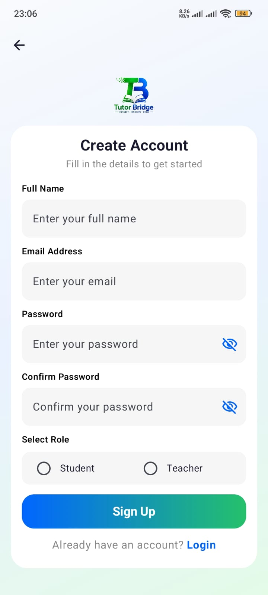
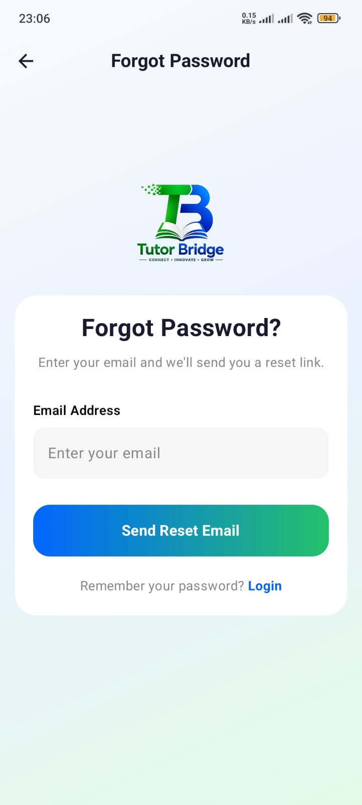
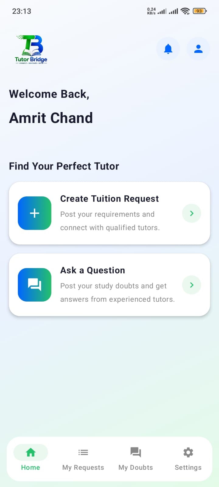
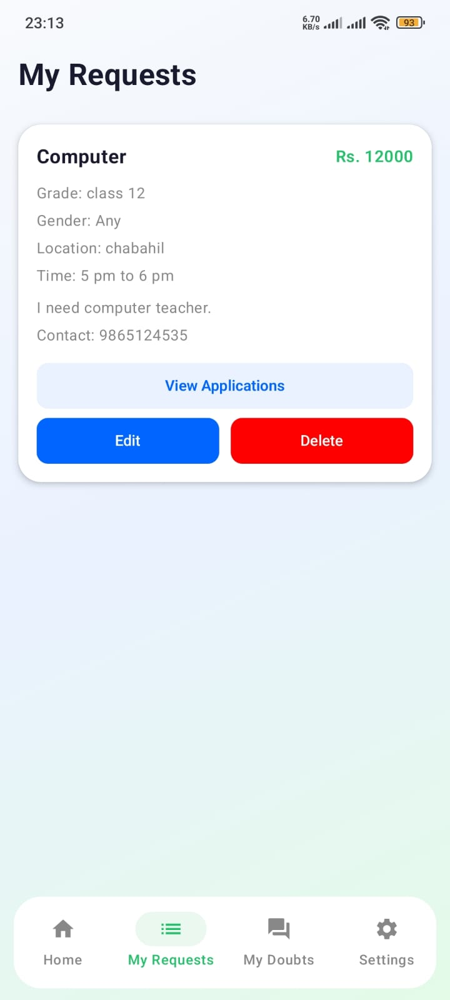
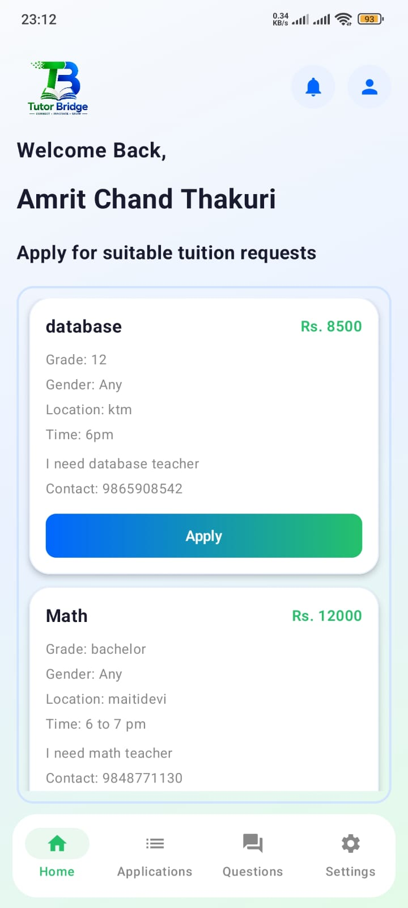
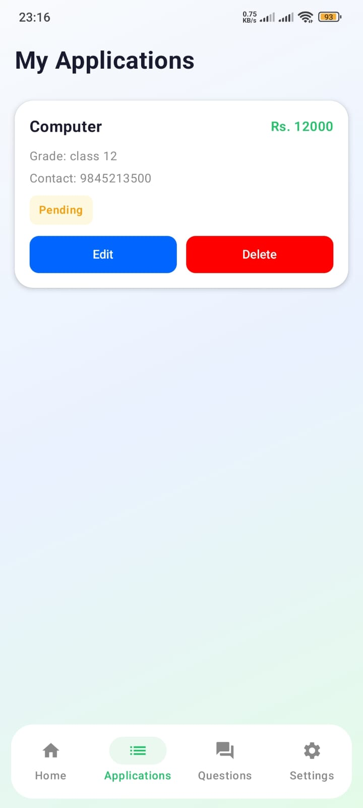
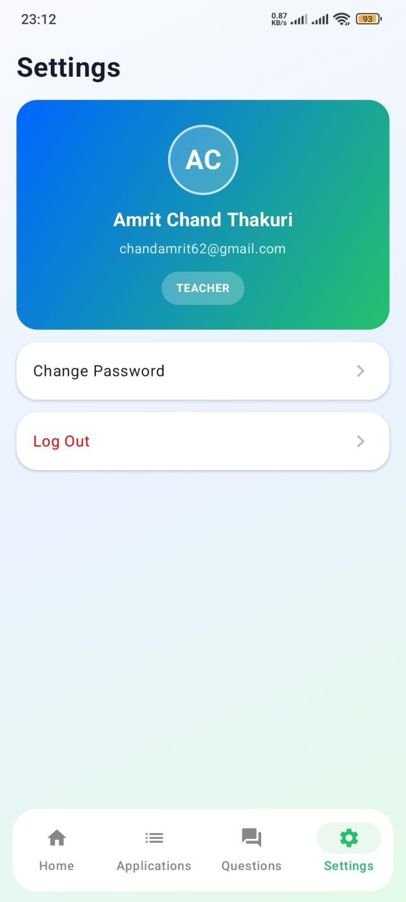
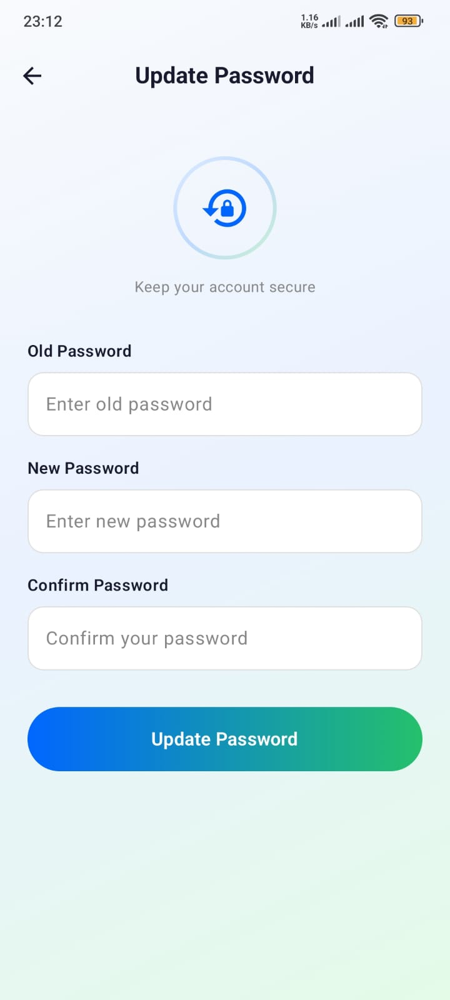

<div align="center">


# Tutor Bridge

**Connecting students and tutors to make finding the right tuition simple.**


</div>

---

## Table of Contents

1. [Introduction](#introduction)
2. [Features](#features)
3. [Screenshots](#screenshots)
4. [Architecture](#architecture)
5. [Why MVVM](#why-mvvm)
6. [Tech Stack](#tech-stack)
7. [Project Structure](#project-structure)
8. [Getting Started](#getting-started)
9. [User Roles](#user-roles)
10. [Author](#author)

---

## Introduction

**Tutor Bridge** is an Android application that bridges the gap between **students looking for a tutor** and **tutors looking for students**.

A student posts exactly what they need — subject, grade, budget, preferred time, location, and preferred tutor gender — and tutors browse open requests and apply directly with their contact details. The student then reviews all applicants and accepts the one they want. From there, both sides stay connected through a real-time notification system, a public doubt-solving Q&A board, and a tutor rating & review system.

This is an **individual project** built to practice production-style Android development end to end: a full Jetpack Compose UI, Firebase Authentication + Realtime Database as the backend, and a strict MVVM architecture applied consistently across every single feature — not just the happy path.

## Features

### For Students
- Sign up / log in with role selection (Student or Teacher), plus Forgot Password and Change Password flows
- Post a tuition request — subject, grade, preferred tutor gender, location, budget, preferred time, description, and contact number
- Edit or delete a posted request at any time
- View every tutor who applied to a request and accept exactly one
- Ask a question ("doubt") to the tutor community, and track the answers it receives under **My Doubts**
- Real-time notifications when a tutor applies to a request or answers a question
- Leave a star rating and written review for a tutor

### For Tutors
- Browse every open tuition request and apply with a contact number
- Track application status — pending, accepted, or rejected — under **My Applications**
- Answer student questions under **Questions**, with the ability to edit or delete their own answer
- Real-time notifications for new requests, new questions, and accepted applications
- View their own aggregate rating and every review left by students

### Shared
- Profile editing, secure password change, persistent login session, and a unified notifications inbox

## Screenshots

<table>
  <tr>
    <td align="center"><br/><b>Splash</b></td>
    <td align="center"><br/><b>Login</b></td>
    <td align="center"><br/><b>Sign Up</b></td>
    <td align="center"><br/><b>Forgot Password</b></td>
  </tr>
  <tr>
    <td align="center"><br/><b>Student Dashboard</b></td>
    <td align="center"><br/><b>My Requests</b></td>
    <td align="center"><br/><b>Edit Profile</b></td>
    <td align="center"><br/><b>Tutor Dashboard</b></td>
  </tr>
  <tr>
    <td align="center"><br/><b>My Applications</b></td>
    <td align="center"><br/><b>Settings</b></td>
    <td align="center"><br/><b>Update Password</b></td>
    <td></td>
  </tr>
</table>

## Architecture

Every feature in Tutor Bridge follows the same four-layer MVVM structure, with data flowing in one direction and state flowing back the other:

```
        calls                 calls                   implemented by              talks to
 View ─────────▶ ViewModel ─────────▶ Repo (interface) ─────────────────▶ RepoImpl ─────────▶ Firebase
   ▲                  │
   └── observes StateFlow<T> ────────┘
```

- **Model** — plain Kotlin data classes with zero logic (`UserModel`, `CreateRequestModel`, `ApplyTuitionModel`, `QuestionModel`, `AnswerModel`, `ReviewModel`, `NotificationModel`)
- **Repo** — an interface plus a Firebase-backed `Impl`; this is the *only* layer allowed to call `FirebaseAuth` / `FirebaseDatabase`
- **ViewModel** — owns `StateFlow` state, validates input, and calls the repo; never touches Firebase directly
- **View** — Jetpack Compose screens that call a ViewModel function and render its state; never touch Firebase or contain business rules

## Why MVVM

MVVM was chosen deliberately over putting logic straight into the Composables, for a few concrete reasons:

- **Separation of concerns** — a screen's UI code never needs to know *how* data is fetched or validated, only *what* state to render. Swapping Realtime Database for Firestore later would only touch the `repo/` layer.
- **Survives configuration changes** — `ViewModel`s survive rotation/recomposition, so in-flight loading state (`isLoading`, form validation, fetched lists) isn't lost the moment the screen redraws.
- **Single source of truth per screen** — every screen exposes its state as `StateFlow`, so the UI is always a pure reflection of the ViewModel's state, not a tangle of local `mutableStateOf` guessing what the backend is doing.
- **Consistency at scale** — with 7+ feature verticals (auth, requests, applications, questions, answers, reviews, notifications) in this app, having one predictable pattern for every feature made it possible to build fast without re-deciding "where does this logic go?" each time.
- **Testability** — because the Repo is an interface, ViewModels can be tested against a fake implementation without ever touching real Firebase (the project doesn't currently ship unit tests, but the seam is there).

## Tech Stack

| Layer | Technology |
|---|---|
| Language | Kotlin |
| UI Toolkit | Jetpack Compose, Material 3 |
| Architecture | MVVM (Model – Repository – ViewModel – View) |
| Backend | Firebase Authentication, Firebase Realtime Database |
| Async / State | Kotlin `StateFlow` |
| Build System | Gradle (Kotlin DSL), Android Gradle Plugin 9.1.1 |
| Min SDK / Target SDK | 31 / 36 |

## Project Structure

```
app/src/main/java/com/example/tutorbridge/
├── model/        # Data classes — UserModel, CreateRequestModel, ApplyTuitionModel,
│                 # QuestionModel, AnswerModel, ReviewModel, NotificationModel
├── repo/         # Firebase-backed repositories (interface + Impl) — the only Firebase layer
├── viewmodel/    # ViewModels exposing StateFlow state to the Views
└── view/         # Jetpack Compose screens (Activities + Composables)
    ├── LoginActivity, SignUpActivity, ForgetPasswordActivity, ChangePassActivity
    ├── StudentDashboard, TutorDashboard
    ├── CreateRequestActivity, MyRequest, ViewApplications
    ├── MyApplications, StudentQuestionsActivity, MyDoubtsActivity, AskQuestionActivity
    ├── NotificationActivity, TutorReviewsActivity
    └── ProfileUpdate, SettingActivity
```

## Getting Started

### Prerequisites
- Android Studio (latest stable)
- A Firebase project with **Authentication (Email/Password)** and **Realtime Database** enabled

### Setup
1. Clone the repository.
2. Create a Firebase project at the Firebase console, add an Android app with package name `com.example.tutorbridge`, and download the generated `google-services.json`.
3. Place `google-services.json` inside the `app/` directory.
4. Open the project in Android Studio and let Gradle sync.
5. Run on an emulator or physical device (minSdk 31+).

## User Roles

On sign-up, a user picks a role — **Student** or **Teacher** — which determines which dashboard they land on (Student vs. Tutor) and which actions are available to them: posting requests vs. applying to them, asking doubts vs. answering them.

## Author

Built and maintained as an individual project by **Amrit Chand Thakuri**.

---

<div align="center">

If you found this project interesting, a ⭐ on the repo is appreciated.

</div>
